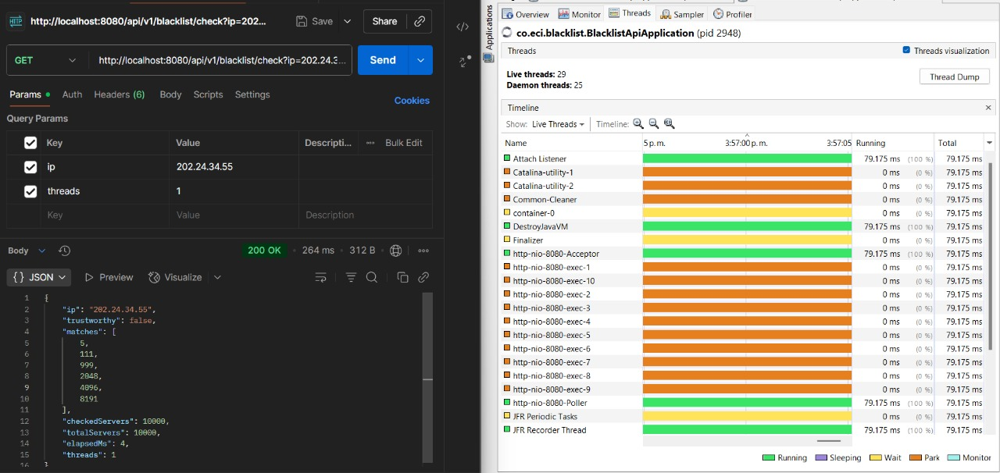
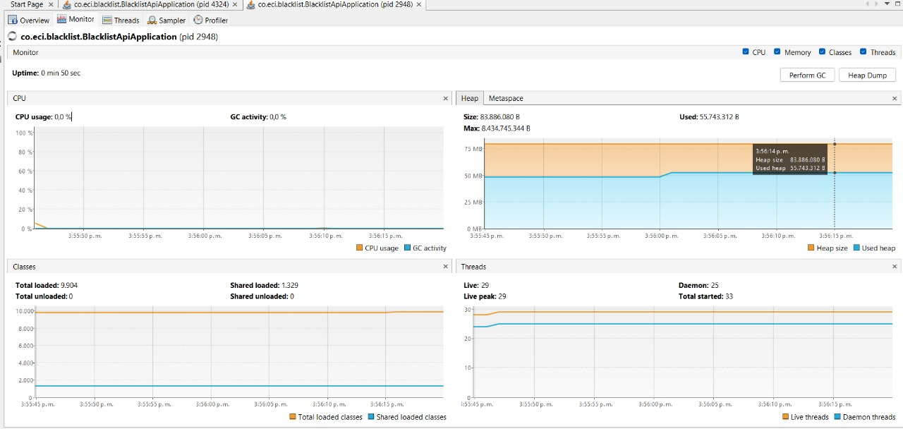
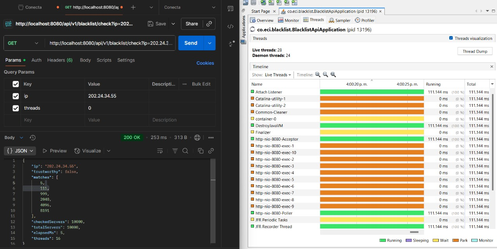
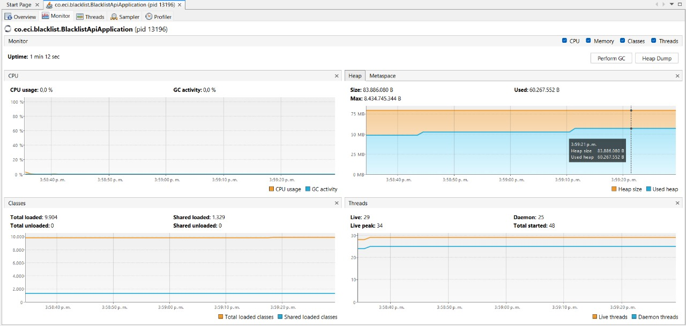
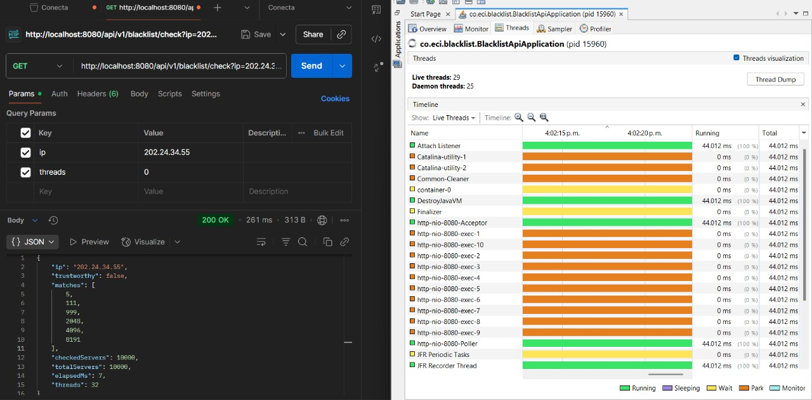
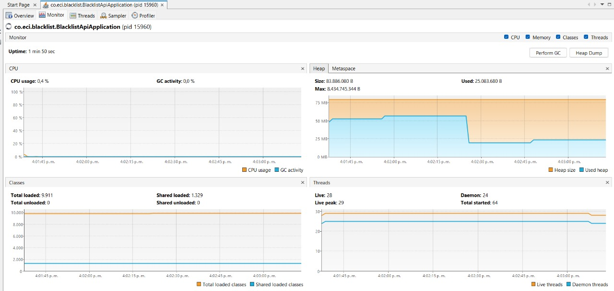
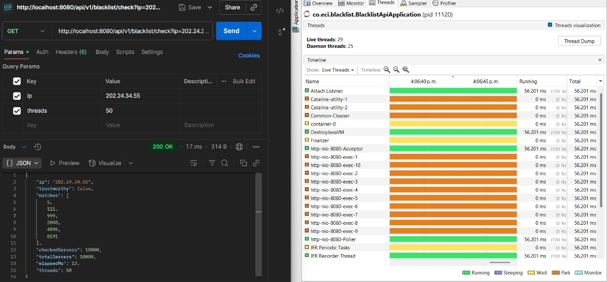
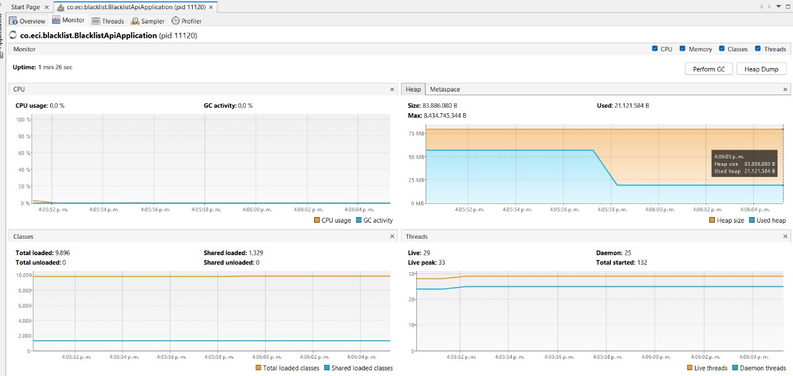
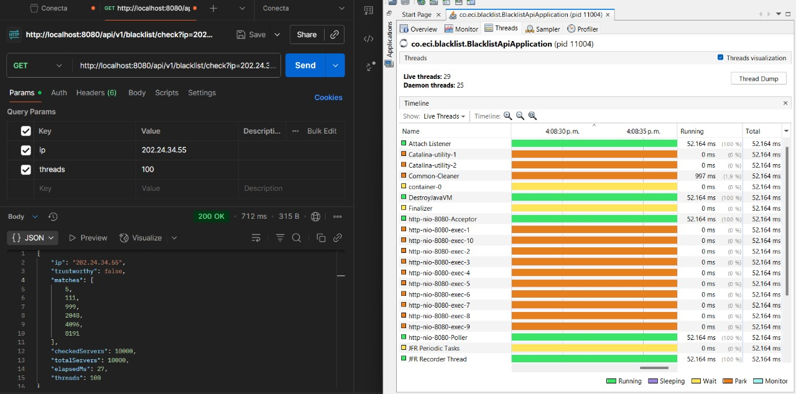
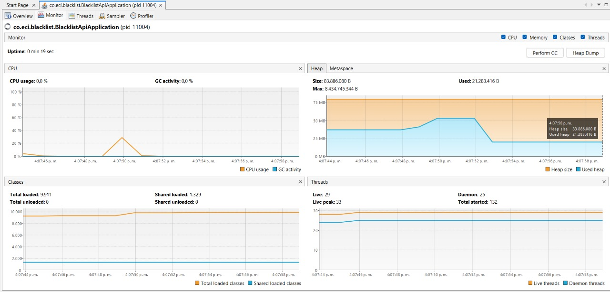

# Laboratorio de Paralelismo -  Parte I: Hilos en Java

**Asignatura:** Arquitectura de Software  
**Profesor:** Javier Iván Toquica Barrera  
**Estudiantes:**
- [Alexandra Moreno](https://github.com/AlexandraMorenoL)
- [Alison Valderrama](https://github.com/LIZVALMU)
- [Jeisson Sánchez](https://github.com/JeissonS02)
- [Valentina Gutierrez](https://github.com/LauraGutierrezr)

---
## 📌 Introducción

La programación concurrente es un paradigma fundamental en el desarrollo de software moderno, especialmente en aplicaciones que requieren alto rendimiento, manejo de múltiples tareas simultáneas o procesamiento paralelo.

En este laboratorio se abordarán conceptos y ejercicios prácticos relacionados con la **creación, control y coordinación de hilos en Java**, además de su integración en aplicaciones reales. A través de diferentes actividades se busca comprender cómo aprovechar la concurrencia para mejorar la eficiencia y escalabilidad de los programas.

---

## 🎯 Objetivos de Aprendizaje

1. Comprender los fundamentos de la **programación concurrente** y el uso de **hilos** en Java.
2. Identificar los problemas comunes de la concurrencia (condiciones de carrera, sincronización, bloqueos).
3. Implementar soluciones usando mecanismos de **coordinación y sincronización** de hilos.
4. Integrar la concurrencia en un proyecto práctico (BlackList API).
5. Analizar las ventajas y limitaciones de la programación concurrente en comparación con la programación secuencial.

---

## 📚 Temas a Abordar en el Laboratorio

- **Fundamentos de concurrencia en Java**
    - Creación y gestión de hilos.
    - Estados de un hilo y ciclo de vida.
    - Diferencias entre `Thread` y `Runnable`.

- **Sincronización y coordinación**
    - Bloqueos (locks).
    - Secciones críticas.
    - Uso de palabras clave como `synchronized`.

- **Problemas comunes de concurrencia**
    - Condiciones de carrera.
    - Deadlocks.
    - Starvation y fairness.

- **Buenas prácticas**
    - Uso de pools de hilos (`ExecutorService`).
    - Estrategias de manejo eficiente de recursos.
    - Diseño seguro y concurrente.

- **Aplicación práctica: BlackList API**
    - Validación de direcciones IP sospechosas.
    - Integración con configuraciones externas.
    - Uso de propiedades y anotaciones de Spring Boot.
    - Ejecución concurrente para mejorar el rendimiento.

---

## 🚀 Inicio del Trabajo: Programación con Hilos

En la primera parte del laboratorio se estudian los fundamentos de los **hilos en Java**.

1. **Creación de hilos:**
    - A través de la clase `Thread`.
    - Implementando la interfaz `Runnable`.

2. **Ejecución concurrente:**
    - Lanzamiento de múltiples hilos.
    - Diferencias entre ejecución secuencial y concurrente.

3. **Problemas identificados:**
    - Al ejecutar varias tareas a la vez, surgen condiciones de carrera si múltiples hilos acceden a los mismos recursos.
    - Es necesario aplicar mecanismos de sincronización.

4. **Primeros ejercicios:**
    - Implementar un sistema que simule búsquedas en listas negras de direcciones IP.
    - Medir diferencias de tiempo entre una ejecución **secuencial** y una **paralela** con múltiples hilos.

---

## 🧩 Experimento propuesto

Se ejecuta la validación de IP dispersa (`202.24.34.55`) con diferentes configuraciones de hilos y se realiza monitoreo con jVisualVM y analizamos **CPU** y **memoria**

1. **1 hilo**.
    

    
    

2. **Núcleos físicos del procesador** `Runtime.getRuntime().availableProcessors()`

    

    

    
3. **El doble de núcleos**.

    

    
    

4. **50 hilos**.

    

    

5. **100 hilos**.

    

    

---

## 📈 Análisis de resultados

Con los datos recolectados, obtuvimos los siguientes grafica:

## 📊 Tabla de Resultados

| Número de Hilos | Tiempo de Ejecución (ms) |
| --------------- | ------------------------ |
| 1               | 264                      |
| 2               | 253                      |
| 4               | 261                      |
| 50              | 17                       |
| 100             | 712                      |

---
## Ley de Amdahl

1) Según la Ley de Amdahl, ¿por qué el mejor desempeño no se logra con cientos de hilos (p. ej. 500)?

Porque la Ley de Amdahl limita la ganancia siempre hay una fracción secuencial que no se puede paralelizar. Con demasiados hilos aparecen sobrecargas de coordinación, consumo de memoria que reducen el beneficio

2) ¿Qué ocurre al usar número de hilos = núcleos vs. el doble de núcleos?

Cuando los hilos ≈ núcleos, se aprovecha al máximo el hardware sin sobrecarga. Al duplicar los hilos, el sistema empieza a repartir tiempo entre ellos (time-sharing), lo que genera más sobrecarga que beneficio.

3) ¿Qué pasaría si, en lugar de un solo equipo, se distribuye el trabajo en 100 máquinas con un hilo cada una?
¿Mejoraría el rendimiento?
¿Cómo influye la fracción paralelizable (P) del problema?

Podría mejorar, porque cada máquina ejecutaría en paralelo sin competir por CPU. Sin embargo, la mejora no es lineal: dependerá del costo de comunicación entre nodos.

## 🛠️ Metodología de Trabajo

- Uso de **Java 21** como SDK principal.
- Gestión del proyecto con **Maven**.
- Documentación y pruebas.
- Control de versiones con **GitHub**.

---

## 📄 Conclusiones Esperadas

- Comprender cómo los hilos permiten la ejecución concurrente y el aumento de eficiencia en sistemas de búsqueda.
- Identificar las diferencias de rendimiento entre ejecución secuencial y concurrente.
- Desarrollar habilidades para detectar y evitar errores comunes en la programación concurrente.
- Establecer bases sólidas para el desarrollo de aplicaciones distribuidas más complejas.

---

  <b>ECI-ARSW Team</b> 
  <i>Empowering well-being through technology</i>

